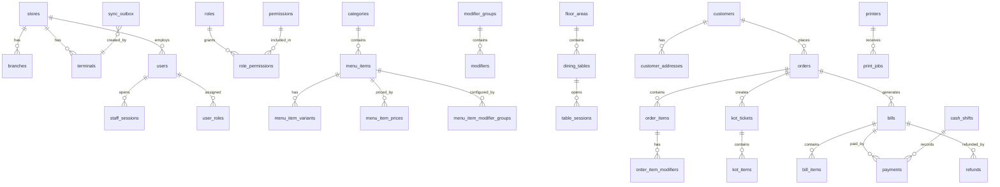

# Complete Database Design

Status: Architecture baseline  
Local database: SQLite through `better-sqlite3` in Electron main process  
Cloud database: MySQL through Laravel API  
Design target: offline-first restaurant POS with full-service and QSR workflows

## 1. Database Strategy

The product uses two compatible schemas:

- SQLite is the operational source of truth on each terminal.
- MySQL is the cloud reporting, backup, admin, and sync authority.
- All POS actions write to SQLite first.
- Sync sends business events and record snapshots to Laravel asynchronously.

Global identity:

- Syncable records use `uuid` as the global identifier.
- SQLite may use `id INTEGER PRIMARY KEY` internally.
- MySQL may use `id BIGINT` internally.
- Cross-device relationships must reference `uuid` fields in sync payloads.

## 2. Shared Columns

Most business tables include these standard columns:

| Column | Type | Notes |
|---|---|---|
| `id` | integer/bigint | local database primary key |
| `uuid` | string | global identifier |
| `store_id` | string | store UUID |
| `terminal_id` | string nullable | terminal UUID that created/changed record |
| `created_by` | string nullable | user UUID |
| `updated_by` | string nullable | user UUID |
| `created_at` | datetime | local creation time |
| `updated_at` | datetime | local update time |
| `deleted_at` | datetime nullable | soft delete tombstone |
| `version` | integer | optimistic sync version |
| `sync_status` | enum | `pending`, `syncing`, `synced`, `failed`, `conflict` |

Financial tables additionally include:

- `business_date`
- `shift_uuid`
- `currency_code`
- amount fields in integer minor units, for example paise/cents
- immutable settled-state rule

## 3. Table Catalog

This design contains 120 tables. Columns below list domain-specific fields; shared columns apply where relevant.

### Organization, Terminal, and Settings

| # | Table | Key Columns | Relationships |
|---:|---|---|---|
| 1 | `stores` | `name`, `code`, `timezone`, `currency_code`, `is_active` | parent of most records |
| 2 | `store_profiles` | `store_uuid`, `legal_name`, `gstin`, `address`, `phone`, `email` | one-to-one with `stores` |
| 3 | `branches` | `store_uuid`, `name`, `code`, `address`, `is_active` | belongs to `stores` |
| 4 | `terminals` | `store_uuid`, `branch_uuid`, `name`, `terminal_code`, `device_fingerprint`, `is_registered` | belongs to `stores`, `branches` |
| 5 | `terminal_sessions` | `terminal_uuid`, `started_at`, `ended_at`, `app_version`, `db_version` | belongs to `terminals` |
| 6 | `devices` | `terminal_uuid`, `device_type`, `name`, `connection_type`, `config_json` | belongs to `terminals` |
| 7 | `device_logs` | `device_uuid`, `level`, `message`, `payload_json` | belongs to `devices` |
| 8 | `app_settings` | `scope`, `key`, `value_json`, `is_sensitive` | store or terminal setting |
| 9 | `feature_flags` | `key`, `enabled`, `scope`, `conditions_json` | controls optional behavior |
| 10 | `business_days` | `business_date`, `opened_at`, `closed_at`, `status` | parent of shifts and reports |

### Security, Staff, and Audit

| # | Table | Key Columns | Relationships |
|---:|---|---|---|
| 11 | `users` | `employee_code`, `display_name`, `email`, `phone`, `is_active` | belongs to store |
| 12 | `user_profiles` | `user_uuid`, `first_name`, `last_name`, `photo_path`, `language` | one-to-one with `users` |
| 13 | `roles` | `name`, `code`, `is_system_role` | assigned to users |
| 14 | `permissions` | `code`, `module`, `description` | assigned through roles |
| 15 | `role_permissions` | `role_uuid`, `permission_uuid` | joins roles and permissions |
| 16 | `user_roles` | `user_uuid`, `role_uuid` | joins users and roles |
| 17 | `staff_sessions` | `user_uuid`, `terminal_uuid`, `shift_uuid`, `login_at`, `logout_at` | belongs to users and terminals |
| 18 | `pin_credentials` | `user_uuid`, `pin_hash`, `pin_salt`, `expires_at` | one active per user |
| 19 | `login_attempts` | `user_identifier`, `terminal_uuid`, `success`, `failure_reason` | audit login behavior |
| 20 | `approval_requests` | `requested_by`, `approved_by`, `action`, `reason`, `status` | manager approval record |
| 21 | `audit_logs` | `actor_uuid`, `action`, `entity_type`, `entity_uuid`, `before_json`, `after_json` | universal audit trail |
| 22 | `security_events` | `event_type`, `severity`, `message`, `metadata_json` | security monitoring |
| 23 | `password_resets` | `user_uuid`, `token_hash`, `expires_at`, `used_at` | cloud/admin reset |

### Catalog, Pricing, Tax, and Discounts

| # | Table | Key Columns | Relationships |
|---:|---|---|---|
| 24 | `categories` | `parent_category_uuid`, `name`, `sort_order`, `is_active` | parent of menu items |
| 25 | `category_routes` | `category_uuid`, `printer_route_uuid`, `kitchen_station_uuid` | routes items to printers/stations |
| 26 | `menu_items` | `category_uuid`, `sku`, `name`, `item_type`, `is_active` | parent of variants and versions |
| 27 | `menu_item_versions` | `menu_item_uuid`, `version_no`, `name_snapshot`, `tax_group_uuid`, `active_from` | historical snapshots |
| 28 | `menu_item_variants` | `menu_item_uuid`, `name`, `sku`, `is_default`, `is_active` | variant-level ordering |
| 29 | `menu_item_prices` | `menu_item_uuid`, `variant_uuid`, `price_book_uuid`, `price_minor`, `active_from`, `active_to` | versioned prices |
| 30 | `modifier_groups` | `name`, `min_select`, `max_select`, `is_required` | parent of modifiers |
| 31 | `modifiers` | `modifier_group_uuid`, `name`, `price_delta_minor`, `is_active` | child of modifier group |
| 32 | `menu_item_modifier_groups` | `menu_item_uuid`, `modifier_group_uuid`, `sort_order` | assigns groups to items |
| 33 | `combo_groups` | `menu_item_uuid`, `name`, `min_select`, `max_select` | combo configuration |
| 34 | `combo_items` | `combo_group_uuid`, `child_menu_item_uuid`, `price_delta_minor` | combo child options |
| 35 | `allergens` | `name`, `code` | allergen master |
| 36 | `menu_item_allergens` | `menu_item_uuid`, `allergen_uuid` | joins items and allergens |
| 37 | `tags` | `name`, `color`, `tag_type` | item/customer tags |
| 38 | `menu_item_tags` | `menu_item_uuid`, `tag_uuid` | joins items and tags |
| 39 | `tax_groups` | `name`, `code`, `is_inclusive` | parent of tax rates |
| 40 | `tax_group_rates` | `tax_group_uuid`, `tax_uuid`, `rate_basis_points`, `effective_from` | tax composition |
| 41 | `taxes` | `name`, `code`, `tax_type`, `rate_basis_points` | GST/VAT/service tax |
| 42 | `charges` | `name`, `charge_type`, `rate_basis_points`, `amount_minor`, `is_active` | service/packing charges |
| 43 | `discounts` | `name`, `discount_type`, `value`, `requires_approval`, `is_active` | discount master |
| 44 | `discount_rules` | `discount_uuid`, `rule_type`, `conditions_json`, `priority` | eligibility logic |
| 45 | `price_books` | `name`, `channel`, `starts_at`, `ends_at`, `is_active` | dine-in/takeaway/delivery pricing |
| 46 | `price_book_items` | `price_book_uuid`, `menu_item_uuid`, `variant_uuid`, `price_minor` | price override |

### Floor, Table, and Reservations

| # | Table | Key Columns | Relationships |
|---:|---|---|---|
| 47 | `floor_areas` | `name`, `sort_order`, `is_active` | parent of tables |
| 48 | `dining_tables` | `floor_area_uuid`, `table_no`, `capacity`, `shape`, `position_json`, `status` | active table map |
| 49 | `table_sessions` | `table_uuid`, `order_uuid`, `opened_at`, `closed_at`, `pax`, `status` | one dining session |
| 50 | `table_transfers` | `from_table_uuid`, `to_table_uuid`, `order_uuid`, `reason` | audit transfers |
| 51 | `table_merges` | `primary_table_uuid`, `merged_table_uuid`, `order_uuid`, `status` | audit merges |
| 52 | `reservations` | `customer_uuid`, `table_uuid`, `reserved_at`, `pax`, `status` | optional reservation flow |
| 53 | `waitlist_entries` | `customer_uuid`, `pax`, `quoted_minutes`, `status` | waiting queue |

### Customers, Delivery, and Channels

| # | Table | Key Columns | Relationships |
|---:|---|---|---|
| 54 | `customers` | `name`, `phone`, `email`, `loyalty_code`, `is_active` | parent of orders/addresses |
| 55 | `customer_addresses` | `customer_uuid`, `label`, `address`, `latitude`, `longitude`, `is_default` | delivery addresses |
| 56 | `customer_notes` | `customer_uuid`, `note`, `visibility`, `created_by` | service notes |
| 57 | `delivery_zones` | `name`, `area_json`, `fee_minor`, `min_order_minor`, `is_active` | delivery fee rules |
| 58 | `delivery_riders` | `name`, `phone`, `vehicle_no`, `is_active` | rider master |
| 59 | `delivery_orders` | `order_uuid`, `customer_address_uuid`, `rider_uuid`, `delivery_status`, `eta_at` | delivery extension |
| 60 | `delivery_status_history` | `delivery_order_uuid`, `status`, `changed_at`, `note` | delivery audit |
| 61 | `third_party_channels` | `name`, `code`, `commission_type`, `is_active` | Swiggy/Zomato/etc. |
| 62 | `channel_orders` | `channel_uuid`, `order_uuid`, `external_order_id`, `payload_json`, `status` | imported channel orders |

### Orders and Cart Lifecycle

| # | Table | Key Columns | Relationships |
|---:|---|---|---|
| 63 | `orders` | `order_no`, `order_mode`, `table_uuid`, `customer_uuid`, `status`, `subtotal_minor`, `total_minor` | parent transaction |
| 64 | `order_items` | `order_uuid`, `menu_item_uuid`, `variant_uuid`, `item_name_snapshot`, `qty`, `unit_price_minor`, `status` | child lines |
| 65 | `order_item_modifiers` | `order_item_uuid`, `modifier_uuid`, `name_snapshot`, `price_delta_minor`, `qty` | modifier snapshots |
| 66 | `order_item_notes` | `order_item_uuid`, `note`, `note_type` | kitchen/customer notes |
| 67 | `order_status_history` | `order_uuid`, `from_status`, `to_status`, `changed_by`, `reason` | lifecycle audit |
| 68 | `order_discounts` | `order_uuid`, `discount_uuid`, `amount_minor`, `reason`, `approval_uuid` | order-level discounts |
| 69 | `order_charges` | `order_uuid`, `charge_uuid`, `amount_minor`, `name_snapshot` | order-level charges |
| 70 | `order_taxes` | `order_uuid`, `tax_uuid`, `taxable_minor`, `tax_minor`, `rate_basis_points` | order tax summary |
| 71 | `order_splits` | `order_uuid`, `split_no`, `status`, `total_minor` | split bill staging |
| 72 | `order_split_items` | `order_split_uuid`, `order_item_uuid`, `qty`, `amount_minor` | split line assignment |
| 73 | `held_orders` | `order_uuid`, `held_by`, `held_at`, `resume_note` | parked orders |
| 74 | `voids` | `order_uuid`, `bill_uuid`, `void_type`, `reason`, `approval_uuid` | void master |
| 75 | `void_items` | `void_uuid`, `order_item_uuid`, `qty`, `amount_minor`, `reason` | voided line items |

### Kitchen / KOT

| # | Table | Key Columns | Relationships |
|---:|---|---|---|
| 76 | `kitchen_stations` | `name`, `code`, `sort_order`, `is_active` | kitchen routing master |
| 77 | `kitchen_station_routes` | `station_uuid`, `category_uuid`, `menu_item_uuid`, `printer_uuid` | station routing |
| 78 | `kot_tickets` | `order_uuid`, `kot_no`, `station_uuid`, `status`, `printed_at` | parent KOT |
| 79 | `kot_items` | `kot_ticket_uuid`, `order_item_uuid`, `qty`, `item_name_snapshot`, `status` | KOT lines |
| 80 | `kot_status_history` | `kot_ticket_uuid`, `from_status`, `to_status`, `changed_by`, `reason` | KOT lifecycle |

### Billing, Payment, Refund, and Cash

| # | Table | Key Columns | Relationships |
|---:|---|---|---|
| 81 | `bills` | `bill_no`, `order_uuid`, `bill_status`, `subtotal_minor`, `tax_minor`, `total_minor`, `closed_at` | finalized charge document |
| 82 | `bill_items` | `bill_uuid`, `order_item_uuid`, `name_snapshot`, `qty`, `unit_price_minor`, `total_minor` | bill line snapshots |
| 83 | `bill_taxes` | `bill_uuid`, `tax_uuid`, `taxable_minor`, `tax_minor`, `rate_basis_points` | tax breakdown |
| 84 | `bill_discounts` | `bill_uuid`, `discount_uuid`, `amount_minor`, `reason`, `approval_uuid` | final discounts |
| 85 | `bill_charges` | `bill_uuid`, `charge_uuid`, `amount_minor`, `name_snapshot` | final charges |
| 86 | `payment_methods` | `name`, `code`, `method_type`, `requires_reference`, `is_active` | cash/card/UPI/custom |
| 87 | `payments` | `bill_uuid`, `payment_method_uuid`, `amount_minor`, `reference_no`, `status`, `paid_at` | tender records |
| 88 | `payment_allocations` | `payment_uuid`, `bill_uuid`, `allocated_minor` | split/combined payment support |
| 89 | `refunds` | `bill_uuid`, `payment_uuid`, `refund_no`, `amount_minor`, `reason`, `approval_uuid` | refund master |
| 90 | `refund_items` | `refund_uuid`, `bill_item_uuid`, `qty`, `amount_minor` | refunded items |
| 91 | `tips` | `bill_uuid`, `payment_uuid`, `amount_minor`, `tip_type` | tip tracking |
| 92 | `cash_rounding_adjustments` | `bill_uuid`, `rounding_minor`, `rule` | cash rounding |
| 93 | `cash_shifts` | `shift_no`, `user_uuid`, `terminal_uuid`, `opened_at`, `closed_at`, `opening_cash_minor`, `status` | shift lifecycle |
| 94 | `cash_movements` | `shift_uuid`, `movement_type`, `amount_minor`, `reason`, `approval_uuid` | paid in/out |
| 95 | `cash_denominations` | `currency_code`, `denomination_minor`, `label`, `is_active` | denomination master |
| 96 | `cash_counts` | `shift_uuid`, `denomination_uuid`, `quantity`, `amount_minor` | close count |
| 97 | `safe_drops` | `shift_uuid`, `amount_minor`, `dropped_by`, `approved_by`, `note` | safe drops |
| 98 | `day_closes` | `business_day_uuid`, `closed_by`, `sales_minor`, `cash_minor`, `variance_minor` | end-of-day close |

### Inventory Lite and Procurement

| # | Table | Key Columns | Relationships |
|---:|---|---|---|
| 99 | `inventory_categories` | `name`, `parent_uuid`, `is_active` | parent for stock items |
| 100 | `units` | `name`, `code`, `precision`, `is_base_unit` | unit master |
| 101 | `inventory_items` | `category_uuid`, `unit_uuid`, `name`, `sku`, `track_stock`, `current_qty` | stock item master |
| 102 | `recipes` | `menu_item_uuid`, `variant_uuid`, `yield_qty`, `unit_uuid`, `is_active` | recipe master |
| 103 | `recipe_items` | `recipe_uuid`, `inventory_item_uuid`, `qty`, `wastage_percent` | recipe ingredients |
| 104 | `suppliers` | `name`, `phone`, `email`, `address`, `is_active` | vendor master |
| 105 | `purchase_orders` | `supplier_uuid`, `po_no`, `status`, `expected_at`, `total_minor` | procurement |
| 106 | `purchase_order_items` | `purchase_order_uuid`, `inventory_item_uuid`, `qty`, `unit_cost_minor` | PO lines |
| 107 | `stock_receipts` | `purchase_order_uuid`, `supplier_uuid`, `receipt_no`, `received_at` | goods received |
| 108 | `stock_movements` | `inventory_item_uuid`, `movement_type`, `qty`, `source_type`, `source_uuid` | stock ledger |
| 109 | `stock_adjustments` | `inventory_item_uuid`, `qty_delta`, `reason`, `approval_uuid` | manual adjustment |
| 110 | `wastage_entries` | `inventory_item_uuid`, `qty`, `reason`, `recorded_by` | wastage tracking |

### Printing, Sync, System, and Reporting

| # | Table | Key Columns | Relationships |
|---:|---|---|---|
| 111 | `printers` | `name`, `printer_type`, `connection_type`, `ip_address`, `port`, `usb_vendor_id`, `status` | print device master |
| 112 | `printer_routes` | `route_name`, `printer_uuid`, `category_uuid`, `station_uuid`, `priority` | routing rules |
| 113 | `print_templates` | `template_type`, `name`, `content_json`, `is_default` | receipt/KOT template |
| 114 | `print_jobs` | `printer_uuid`, `template_uuid`, `source_type`, `source_uuid`, `status`, `payload_json` | durable print queue |
| 115 | `print_job_attempts` | `print_job_uuid`, `attempt_no`, `status`, `error_message`, `attempted_at` | retry audit |
| 116 | `cash_drawer_events` | `terminal_uuid`, `printer_uuid`, `triggered_by`, `reason`, `status` | cash drawer audit |
| 117 | `sync_outbox` | `event_uuid`, `aggregate_type`, `aggregate_uuid`, `event_type`, `payload_json`, `status`, `attempts` | local-to-cloud queue |
| 118 | `sync_inbox` | `event_uuid`, `source_terminal_uuid`, `aggregate_type`, `payload_json`, `applied_at` | idempotent inbound events |
| 119 | `sync_state` | `scope`, `last_push_at`, `last_pull_at`, `last_cursor`, `status` | sync progress |
| 120 | `conflict_log` | `aggregate_type`, `aggregate_uuid`, `local_version`, `remote_version`, `resolution`, `payload_json` | conflict audit |
| 121 | `sync_batches` | `batch_uuid`, `direction`, `started_at`, `finished_at`, `status`, `event_count` | batch-level telemetry |
| 122 | `sync_cursors` | `entity_type`, `cursor_value`, `last_seen_at` | pull cursor per entity |
| 123 | `report_exports` | `report_type`, `format`, `file_path`, `requested_by`, `status` | export history |
| 124 | `report_snapshots` | `report_type`, `business_date`, `payload_json`, `generated_at` | cached report data |
| 125 | `notification_events` | `event_type`, `title`, `message`, `read_at`, `severity` | in-app notifications |
| 126 | `system_health_checks` | `check_type`, `status`, `message`, `checked_at` | startup/diagnostics |
| 127 | `backups` | `backup_type`, `file_path`, `size_bytes`, `checksum`, `status` | backup registry |
| 128 | `migration_history` | `migration_name`, `batch_no`, `applied_at`, `checksum` | SQLite migration ledger |
| 129 | `error_logs` | `source`, `level`, `message`, `stack_trace`, `metadata_json` | app errors |
| 130 | `job_locks` | `lock_key`, `owner`, `expires_at` | prevents duplicate workers |
| 131 | `app_versions` | `version`, `build_no`, `released_at`, `notes` | update tracking |
| 132 | `db_integrity_checks` | `checked_at`, `status`, `result_json` | database integrity history |

## 4. Core Relationships

## 5. Financial Immutability Rules

- `bills`, `bill_items`, `bill_taxes`, `payments`, and `refunds` are append-only once closed.
- Editing a settled transaction requires a `refund`, `void`, or compensating adjustment.
- `order_items` can be edited only before bill settlement unless a manager approval creates a void/refund trail.
- Payment deletion is not allowed; failed/reversed status must be recorded instead.
- Reprints are recorded through `print_jobs`, `print_job_attempts`, and `audit_logs`.

## 6. Required Indexes

Create indexes for these lookup patterns:

- `uuid` unique index on every syncable table.
- `store_id`, `terminal_id`, `sync_status` on syncable tables.
- `orders(order_no)`, `orders(status)`, `orders(business_date)`.
- `orders(table_uuid, status)` for active table lookup.
- `order_items(order_uuid)`.
- `bills(bill_no)`, `bills(order_uuid)`, `bills(business_date)`.
- `payments(bill_uuid)`, `payments(shift_uuid)`, `payments(paid_at)`.
- `print_jobs(status, created_at)`.
- `sync_outbox(status, created_at, attempts)`.
- `audit_logs(entity_type, entity_uuid)`.

## 7. SQLite Runtime Configuration

- Enable WAL mode.
- Enable foreign keys.
- Use busy timeout.
- Run migrations at app startup before login.
- Wrap all order, bill, payment, print, and sync writes in transactions.
- Persist print jobs before printer dispatch.
- Store money as integer minor units only.

## 8. MySQL Cloud Mapping

Laravel/MySQL should mirror operational entities with these differences:

- Use `BIGINT UNSIGNED` internal IDs.
- Keep `uuid` unique across tenants where needed.
- Add tenant/store authorization scopes on all queries.
- Use queue workers for sync event processing.
- Store raw sync event payloads for audit and replay.
- Generate cloud reports from accepted synced records.

## 9. Seed Data Required

Minimum production seed data:

- default permissions
- default roles: admin, manager, cashier, waiter, kitchen
- default payment methods: cash, card, UPI, custom
- default taxes/tax groups
- default cash denominations
- default print templates
- default feature flags

## 10. Database Acceptance Criteria

- Schema supports at least 100 tables with documented relationships.
- Terminal can create orders, KOTs, bills, payments, and print jobs while offline.
- Sync outbox captures every business mutation needed for cloud reconstruction.
- Settled bills and payments cannot be silently edited.
- Menu item price/tax snapshots preserve historical bill accuracy.
- Printer failure does not lose print intent.
- Conflict log records cloud/local version conflicts.
